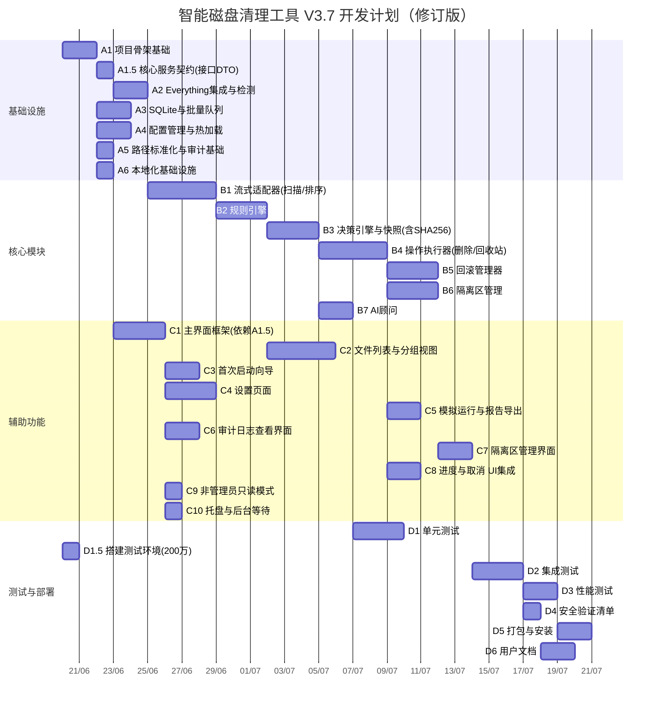

### 一、WBS 任务清单（修订版）

#### 阶段 A：基础设施

| ID | 任务名称 | 输入条件（依赖） | 完成标准（DoD） | 预估工时 |

|----|----------|----------------|----------------|----------|

| A1 | 项目骨架与基础框架搭建 | 无 | .NET 8 项目创建；日志、取消令牌、进度报告接口定义；配置数据模型完成 | 2 d |

| **A1.5** | **定义核心服务契约（接口与 DTO）** | **A1** | **输出 `IFileListProvider`、`IRuleEngine`、`IDecisionEngine`、`IOperationExecutor` 等接口，及 `FileItem`、`DeleteSnapshotEntry` 等 DTO；UI 团队可据此用 Mock 数据并行开发** | **1 d** |

| A2 | Everything SDK 集成与依赖检测 | A1 | Everything_GetVersion、IPC ping、FRN 探测、索引就绪检测；版本阻断；FRN_AVAILABLE 标记 | 2 d |

| A3 | SQLite 数据库初始化与批量写入队列 | A1 | 表创建；WAL 模式；ConcurrentQueue 批处理（500ms/200条） | 2 d |

| A4 | 配置管理（JSON + 热加载基础设施） | A1 | UserConfig 读写；RuleCacheVersion；FileSystemWatcher 防抖；版本号递增 | 2 d |

| A5 | 路径标准化工具与审计日志基础 | A1 | `\\?\` 路径函数库；审计日志仅暴露 Insert 方法；基础写入 | 1 d |
| A6 | 本地化基础设施 | A1 | .resx 资源文件（中/英）；`ILocalizationService` 接口；语义标签映射表；语言切换 | 0.5 d |

---

#### 阶段 B：核心模块

| ID | 任务名称 | 输入条件（依赖） | 完成标准（DoD） | 预估工时 |

|----|----------|----------------|----------------|----------|

| B1 | Everything 流式适配器（扫描+排序下推） | A2, A3, A5, A1.5 | `yield return` 流式枚举；原生排序传递；墓碑过滤（FRN/降级指纹）；路径标准化；内存<200MB | 4 d |

| B2 | 规则引擎（硬规则+启发式+热加载） | A4, B1 | 输出 rule_verdict 和 semantic_category；缓存版本比对；热加载触发重扫 | 3 d |

| B3 | 决策引擎（仲裁逻辑+快照生成） | B2 | 实现决策表；**快照生成时同步计算每个文件的 SHA‑256（可取消，有进度上报）**，填入 `DeleteSnapshotEntry.Hash`；序列化 JSON 写入 DeletionRecord；深拷贝脱离缓存 | 3 d |

| B4 | 操作执行器（乐观删除+回收站+跨卷复制） | B3, A3, A5 | IFileOperation 删除；SHQueryRecycleBin 容量预检；跨卷复制 `.cleaning.tmp`；取消/失败清理；锁失败降级；**仅校验已存在的哈希，不重新计算** | 4 d |

| B5 | 回滚管理器（恢复+哈希校验+墓碑清除） | B4, A3, A5 | 恢复文件并验证 SHA‑256；按 operation_id 删除墓碑；失败警告 | 3 d |

| B6 | 隔离区管理（空间+大文件绕过+异步SHA256） | B4, A3 | 容量阈值；跨卷复制策略；大文件绕过；异步校验（IProgress+取消）；校验后重命名 | 3 d |

| B7 | AI 顾问（API 调用+速率限制+自动触发） | B3 | OpenAI/Ollama 自定义 API；单次≤500文件，30RPM，并发5；超时不阻塞 | 2 d |

---

#### 阶段 C：辅助功能

| ID | 任务名称 | 输入条件（依赖） | 完成标准（DoD） | 预估工时 |

|----|----------|----------------|----------------|----------|

| C1 | 用户主界面框架（仪表板+操作栏+状态栏） | **A1.5**（非 B1） | 主窗口布局完成；仪表板卡片、操作栏、状态栏（含进度条/取消）；**可用 Mock 数据先行开发** | 3 d |

| C2 | 文件列表与分组视图（语义标签+显示全部切换） | C1, B1, B2 | 分组树生成；文件列表列；排序下推；分组仅显示可操作文件；"显示所有文件"平面列表，列头排序 | 4 d |

| C3 | 首次启动向导（Everything 检测 + 配置步骤） | A2, A4, C1 | 向导所有步骤；索引未就绪选项；后台等待托盘交互 | 2 d |

| C4 | 设置页面（五个标签页） | A4, C1 | 各标签页实现；配置保存生效；规则热加载路径 | 3 d |

| C5 | 模拟运行与报告导出 | B4, C1 | 模拟运行复用扫描路径；生成 HTML/CSV | 2 d |

| C6 | 审计日志查看界面与历史记录 | A5, C1 | 审计日志列表；删除批次历史；支持回滚 | 2 d |

| C7 | 隔离区管理界面 | B6, C1 | 隔离区文件列表；批量恢复/删除；容量显示 | 2 d |

| C8 | 进度与取消 UI 集成 | B4, C1 | 状态栏进度百分比；取消按钮终止任务；临时文件清理 | 2 d |

| C9 | 非管理员只读模式处理 | A1, C1 | 非管理员启动时删除按钮禁用，分析功能正常 | 1 d |

| C10 | 托盘图标与后台等待交互 | A2, C1 | 后台等待最小化托盘；双击唤回；通知和右键菜单 | 1 d |

---

#### 阶段 D：测试与部署

| ID | 任务名称 | 输入条件（依赖） | 完成标准（DoD） | 预估工时 |

|----|----------|----------------|----------------|----------|

| D1 | 单元测试（核心逻辑） | **B5**（B1-B7 全部完成） | xUnit 覆盖率>80%；覆盖 B1-B7 各模块；Everything 适配器 Mock；所有测试通过 | 3 d |

| **D1.5** | **搭建性能与集成测试环境** | **无（可与 D1 并行）** | **安装 Everything 1.4.1.1000+；生成含 200 万文件的 NTFS 测试卷；准备好模拟回收站/隔离区环境；脚本可用** | **1 d** |

| D2 | 集成测试（端到端流程） | C10, C9, C8, C7, C6, C5, C4, C3, C2, D1, **D1.5** | 真实 Everything 环境全流程测试；非管理员模式；索引未就绪；取消操作；测试通过并记录 | 3 d |

| D3 | 性能测试（200万文件+排序+内存） | D2 | 流式内存<200MB；排序下推；批量写入不阻塞 UI；响应达标 | 2 d |

| D4 | 安全验证清单逐项检查 | D2 | 逐条验证第11章安全清单；全部通过 | 1 d |

| D5 | 打包与安装程序 | D3, D4 | 生成 MSI 安装包；Everything 检测引导；首次运行正常 | 2 d |

| D6 | 用户文档与帮助 | D5 | 用户手册（中/英）、帮助页面；README | 2 d（可与 D5 并行） |

---

### 二、关键路径与并行关系（修正后）

- **关键路径（串行）**：  

  A1 → A1.5 → A2 → A3 → A4 → A5 → B1 → B2 → B3 → B4 → B5 → D2 → D3 → D4 → D5  

  （A6 可与 A2/A3/A4 并行；A4 已纳入关键路径——B2 依赖 A4 的热加载基础设施）

- **并行改进**：  

  - C1 依赖 A1.5，与 B1 并行启动，节省约 3 个自然日。  

  - C6（审计界面）依赖 A5，可提前启动。  

  - D1.5 与 D1 并行，确保测试环境提前就绪。

---

### 三、甘特图（Mermaid，修正后）

> **总工期估算**：关键路径仍由 B1→B2→B3→B4→B5 主导，但 C1 提前启动使 UI 相关任务可更早完成，不影响整体关键路径长度。总关键路径时长约 **34 个工作日**，但并行窗口更宽，实际项目日历日约 **36 天**（由于 C1 提前，整体灵活度提升）。